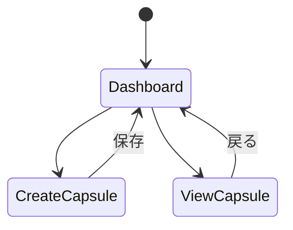

MVPのための基本設計書

# 1. MVPの機能範囲

## 1.1 実装する主要機能
1. タイムカプセル作成機能
2. タイムカプセル表示機能
3. 基本的なエイジング効果
4. ローカルストレージ保存

## 1.2 延期する機能
- X連携
- 詳細なアニメーション
- メール通知
- 高度なタグ付け

# 2. システム設計

## 2.1 クラス構造
```python
class CodeCapsule:
    """メインアプリケーションクラス"""
    def __init__(self):
        self.page: ft.Page
        self.store: CapsuleStore
        self.current_view: ft.View

class CapsuleStore:
    """データ管理クラス"""
    def __init__(self):
        self.capsules: dict[str, CapsuleData]

class CapsuleData:
    """タイムカプセルデータモデル"""
    def __init__(self):
        self.id: str
        self.code: str
        self.message: str
        self.created_at: datetime
        self.open_at: datetime

class CapsuleEditor(ft.UserControl):
    """タイムカプセル作成画面"""
    def __init__(self):
        self.code_editor: ft.TextField
        self.message_editor: ft.TextField

class CapsuleViewer(ft.UserControl):
    """タイムカプセル表示画面"""
    def __init__(self):
        self.code_display: ft.TextField
        self.message_display: ft.Text
```

## 2.2 画面遷移図


## 2.3 データ構造
```json
{
  "capsules": {
    "capsule_id": {
      "id": "uuid文字列",
      "code": "コードテキスト",
      "message": "メッセージテキスト",
      "created_at": "ISO8601形式の日時",
      "open_at": "ISO8601形式の日時"
    }
  }
}
```

# 3. UI設計

## 3.1 ダッシュボード画面
```python
ft.Column([
    ft.Text("CodeCapsule", size=40, font_family="Roboto Mono"),
    ft.ElevatedButton("新規作成", on_click=self.new_capsule),
    ft.ListView([
        # タイムカプセルのリスト
    ])
])
```

## 3.2 タイムカプセル作成画面
```python
ft.Column([
    ft.TextField(
        multiline=True,
        label="コード",
        font_family="Roboto Mono"
    ),
    ft.TextField(
        multiline=True,
        label="未来の自分へのメッセージ"
    ),
    ft.DatePicker("開封日を選択"),
    ft.ElevatedButton("タイムカプセルを埋める")
])
```

# 4. 実装優先順位

1. Phase 1 (30分)
   - 基本的なUI構築
   - 画面遷移の実装

2. Phase 2 (40分)
   - コードエディタ実装
   - メッセージ入力機能実装

3. Phase 3 (30分)
   - ローカルストレージ実装
   - タイムカプセル一覧表示

4. Phase 4 (20分)
   - 基本的なエイジング効果実装
   - バグ修正とテスト

# 5. 技術的詳細

## 5.1 使用するFletコントロール
- `ft.View`: 画面管理
- `ft.TextField`: コード/メッセージ入力
- `ft.ListView`: タイムカプセル一覧
- `ft.Card`: タイムカプセル表示
- `ft.DatePicker`: 開封日選択

## 5.2 エイジング効果の実装方法
```python
def calculate_aging_effect(created_at: datetime) -> dict:
    """経過時間に基づいてUIスタイルを返す"""
    days = (datetime.now() - created_at).days
    if days < 7:
        return {"opacity": 1.0, "bgcolor": "white"}
    elif days < 30:
        return {"opacity": 0.9, "bgcolor": "#f5f5f5"}
    else:
        return {"opacity": 0.8, "bgcolor": "#e0e0e0"}
```
